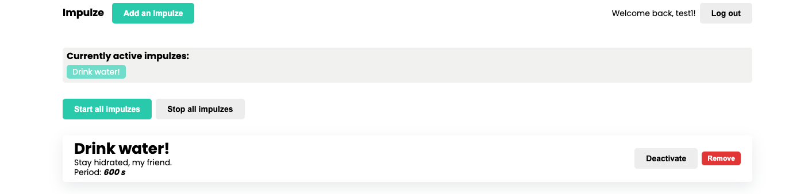
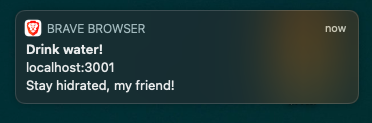

# ⚡️ Impulze

<p align="center">

<br />
Get reminded on a periodic basis!
</p>

## Repository description

This repository houses the back-end application for the Impulze reminder application.



The application uses native browser notifications on the front-end to notify you about you reminders.



## Project description

Below are some commands that should get you set up for development.

## Environment setup

First, you'll have to install packages by running:

```bash
npm install
```

Then, copy the contents of the .env.example file into your .env file.

## Starting the development server
After setting up the application, you can start the development server by running the following command.

```bash
npm run dev
```

which is the equivalent of:

```sh
node ace serve --watch
```

- The `serve` command starts the HTTP server and performs an in-memory compilation of TypeScript to JavaScript.
- The `--watch` flag is meant to watch the file system for changes and restart the server automatically.

By default, the server starts on port 3333 (defined inside the .env file). You can view the welcome page by visiting: http://localhost:3333.

For development, the application will create an SQLite database for you to play around with. The testing framework will use a different instance of a database to avoid damaging testing data.

You can also use yarn if you so prefer.

## Running tests

For running the tests, run:

```bash
npm run test
```

## Running the lint checks

To run the linter, run

```bash
npm run lint
```

## Compiling for production
You must always deploy the compiled JavaScript on your production server. You can create the production build by running the following command:

```bash
npm run build
```

which is the equivalent of:

```sh
node ace build --production
```

The compiled output is written to the `build` folder. You can `cd` into this folder and start the server by directly running the `server.js` file. Learn more about the [TypeScript build process](./fundamentals/typescript-build-process.md)

```sh
cd build
node server.js
```
